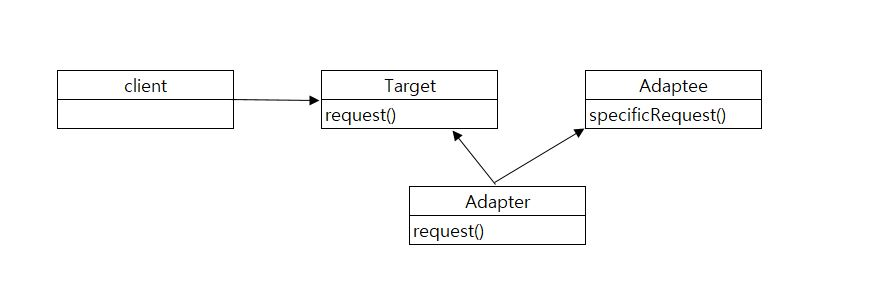
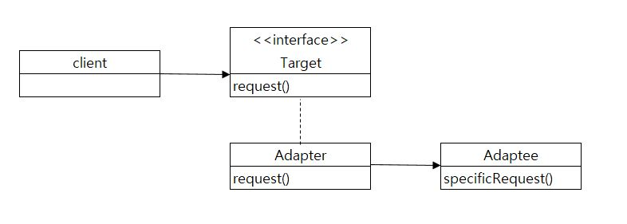

# Adapter Pattern

한 클래스의 인터페이스를 클라이언트에서 사용하고자하는 다른 인터페이스로 변환한다.
어댑터를 이용하면 인터페이스 호환성 문제 때문에 같이 쓸 수 없는 클래스들을 연결해서 쓸 수 있다.
어댑터 종류

- 클래스 어댑터
    다중상속이 필요하다
    타겟과 어댑티 모두의 서브클래스로 만든다


- 객체 어댑터
    구성을 통하여 어댑티에 요청을 전달한다

### 예제
결제시스템을 구현하였다.

초반에는 실물카드로만 결제하였다.
```java
public interface CreditCard {
	public void pay();
}

public class VisaCard implements CreditCard {
	@Override
	public void pay() {
		System.out.println("pay with VisaCard");
	}
}
```

기술이 발전된후 앱카드가 생겨났다.
```java
public interface AppPay {
	public void payWithApp();
}
public class VisaPay implements AppPay {
	@Override
	public void payWithApp() {
		System.out.println("pay with VisaPay");
	}
}
```
어뎁터패턴을 사용하여 기존에 사용하던 실물카드를 앱카드로 사용하려고한다.
```java
public class AppCardAdapter implements AppPay {

	CreditCard creditCard;
	public AppCardAdapter(CreditCard creditCard){
		this.creditCard = creditCard;
	}
	
	@Override
	public void payWithApp() {
		creditCard.pay();
	}
}
```
결제시스템을 실행해보자
```java
public class PaySystem {

	public static void main(String[] args) {
		
		VisaCard card = new VisaCard(); //실물카드
		VisaPay appCard = new VisaPay();//앱카드
		
		card.pay();
		appCard.payWithApp();
		
		AppCardAdapter appCardAdapter = new AppCardAdapter(card);//기존의 실물카드로 만든 앱카드
		appCardAdapter.payWithApp();
	}
}
```