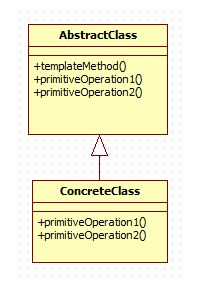

# template method pattern
- 어떤 작업을 처리하는 일부분을 서브 클래스로 캡슐화해 전체 일을 수행하는 구조는 바꾸지 않으면서 특정 단계에서 수행하는 내역을 바꾸는 패턴이다.
- 전체적으로는 동일하면서 부분적으로는 다른 구문으로 구성된 메서드의 코드 중복을 최소화 할 때 유용하다.


 ##### AbstractClass
- 템플릿 메서드를 정의하는 클래스
- 하위 클래스에 공통 알고리즘을 정의하고 하위 클래스에서 구현될 기능을 primitive 메서드 또는 hook 메서드로 정의하는 클래스

 ##### ConcreteClass
- 물려받은 primitive 메서드 또는 hook 메서드를 구현하는 클래스
- 상위 클래스에 구현된 템플릿 메서드의 일반적인 알고리즘에서 하위 클래스에 적합하게 primitive 메서드나 hook 메서드를 오버라이드하는 클래스

# Example
사람들의 일반적인 하루일과이다.
일어나고 밥먹고 본인의 일을하고 잠을잔다.
여가시간이 있으면 취미를 즐기기도한다.
```java
public abstract class Person {
	void dailyRoutine() {
		wakeUp();
		eatMeal();
		doMyWork();
		if(isFreeTime()) {
			doHobby();
		}
		goToBed();
	}
	abstract void doMyWork();
	final void wakeUp() {
		System.out.println("wake up in the morning");	
	}
	final void eatMeal() {
		System.out.println("eat delicious meal");
	}
	final void goToBed() {
		System.out.println("go to bed");
	}
	boolean isFreeTime() {
		return false;
	}
	void doHobby() {
	}
}
```
학생은 공부를 하고 여가시간이 없어 취미가 없다.
```java
public class Student extends Person {
	@Override
	void doMyWork() {
		System.out.println("I'm studying");
	}
}
```
직장인은 일을 하고 여가시간이 없어 취미가 없다.
```java
public class Worker extends Person {
	@Override
	void doMyWork() {
		System.out.println("I'm working");
	}
}
```
건물주은 건물을 관리하고, 여가시간이 있어 취미로 요가를한다.
```java
public class LandLord extends Person {
	@Override
	void doMyWork() {
		System.out.println("I'm managing my buliding");
	}
	@Override
	boolean isFreeTime() {
		return true;
	}
	@Override
	void doHobby() {
		System.out.println("I do yoga");
	}
}
```
메인
```java
public class TempWorld {

	public static void main(String[] args) {
		
		//학생은 일어나고,밥먹고,공부하고,잡니다.
		Student student = new Student();
		student.dailyRoutine();
		
		//직장인은 일어나고,밥먹고,일하고,잡니다.
		Worker worker = new Worker();
		worker.dailyRoutine();
		
		//건물주는 일어나고,밥먹고,건물관리하고,여가시간이남으면 요가를하고,잡니다.
		LandLord landlord = new LandLord();
		landlord.dailyRoutine();
	}
}
```